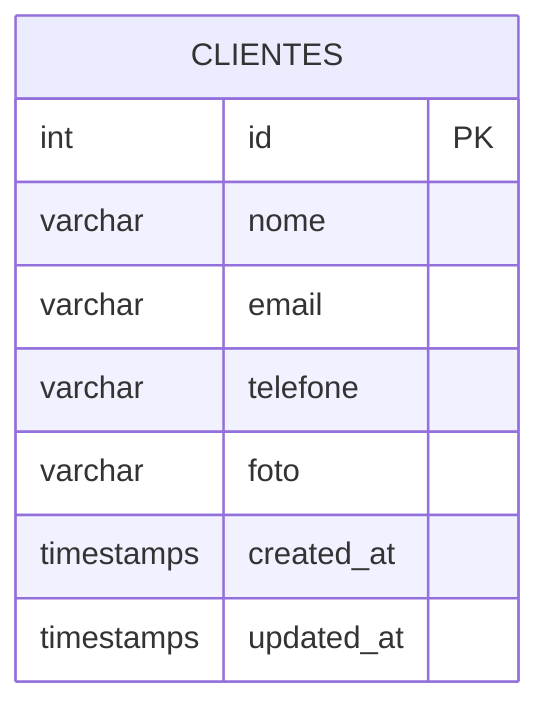

# Sistema de Cadastro de Clientes

Este projeto é um **Sistema de Cadastro de Clientes** desenvolvido com o **Framework Laravel** e segue o padrão **MVC**. Ele fornece funcionalidades para criar, visualizar, atualizar e excluir registros de clientes com upload de fotos.

## Funcionalidades
- **Operações CRUD**: Criar, Ler, Atualizar e Excluir clientes.
- **Upload de Fotos**: Envio e exibição de fotos dos clientes.
- **Validação**: Validação de campos como nome, e-mail, telefone e imagem.
- **Arquitetura MVC**: Código organizado seguindo o padrão MVC do Laravel.
- **Interfaces Responsivas**: Interface amigável utilizando templates Blade.

## Requisitos
- PHP >= 8.0
- Composer
- Laravel 10.x
- Banco de Dados MySQL
- Servidor Web (Apache, Nginx, etc.)

## Instalação
1. Clone o repositório:
```bash
 git clone https://github.com/username/client-management-system.git
```

2. Navegue até a pasta do projeto:
```bash
 cd client-management-system
```

3. Instale as dependências:
```bash
 composer install
 npm install
```

4. Crie o arquivo **.env**:
```bash
 cp .env.example .env
```

5. Configure a conexão com o banco de dados no arquivo `.env`:
```
DB_CONNECTION=mysql
DB_HOST=127.0.0.1
DB_PORT=3306
DB_DATABASE=nome_do_banco
DB_USERNAME=usuario
DB_PASSWORD=senha
```

6. Gere a chave da aplicação:
```bash
 php artisan key:generate
```

7. Execute as migrações do banco de dados:
```bash
 php artisan migrate
```

8. Crie um link simbólico para armazenar imagens:
```bash
 php artisan storage:link
```

9. Inicie o servidor de desenvolvimento:
```bash
 php artisan serve
```

10. Acesse o sistema pelo navegador:
```
 http://localhost:8000
```

## Uso
- Navegue até a página inicial para visualizar a lista de clientes.
- Adicione novos clientes clicando no botão **Adicionar Novo Cliente**.
- Edite ou exclua clientes utilizando os botões na lista.
- Visualize as fotos enviadas diretamente na lista de clientes.

## Estrutura de Arquivos
```
app/
├── Models/
│   └── Cliente.php          # Modelo Cliente
├── Http/
│   └── Controllers/
│       └── ClienteController.php # Controlador para operações com clientes
resources/
├── views/
│   └── clientes/
│       ├── index.blade.php  # Lista de clientes
│       ├── create.blade.php # Formulário para criação
│       └── edit.blade.php   # Formulário para edição
routes/
├── web.php                  # Rotas do aplicativo
```

## Testes
Execute testes unitários com PHPUnit:
```bash
 php artisan test
```

## Modelo Relacional



